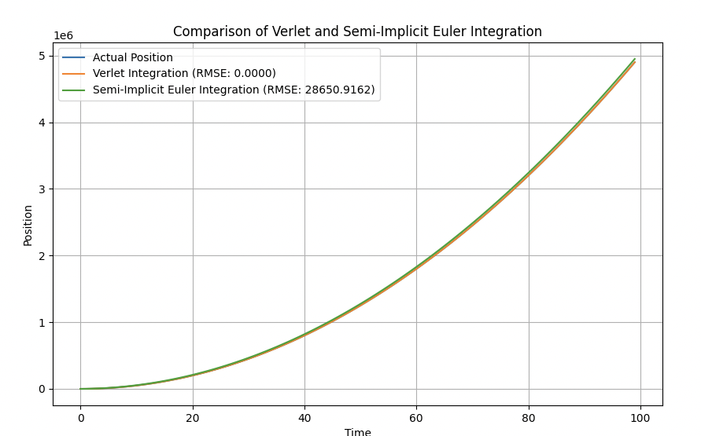

# Numerical Integration Comparison

This repository contains code for comparing two numerical integration methods, Verlet integration and semi-implicit Euler integration, in simulating the position of a particle under the influence of gravity.

## Introduction

Numerical integration methods are commonly used in physics simulations to approximate the behavior of physical systems. In this experiment, we compare the accuracy and performance of two popular integration methods: Verlet integration and semi-implicit Euler integration.

## Integration Methods

### Verlet Integration

Verlet integration is a symplectic integration method that is commonly used for simulating the motion of particles in physics simulations. It is a second-order accurate method that is known for its stability and energy conservation properties.

### Semi-Implicit Euler Integration

Semi-implicit Euler integration, also known as symplectic Euler integration, is another commonly used integration method. It is a first-order accurate method that is simpler to implement compared to Verlet integration.

## Experiment Setup

The experiment is set up as follows:

1. Define the initial position and velocity of the particle.
2. Specify the simulation parameters, such as the time step and simulation time.
3. Perform Verlet integration and semi-implicit Euler integration to simulate the particle's position over time.
4. Calculate the actual position of the particle using the known equations of motion.
5. Compare the simulated positions with the actual position to evaluate the accuracy of the integration methods.

## How to run

To run the code, follow these steps:

```sh
pip install  -e .

python vervet_vs_semi_implicit_eulur/main.py


```

## Results





The generated chart allows you to visually compare the actual position with the positions obtained from the numerical integration methods. Additionally, the root mean square error (RMSE) is calculated for each integration method, providing a quantitative measure of the error.

## Conclusion

Based on the results obtained, you can draw conclusions about the accuracy and performance of the Verlet integration and semi-implicit Euler integration methods in simulating the particle's position under the influence of gravity.
